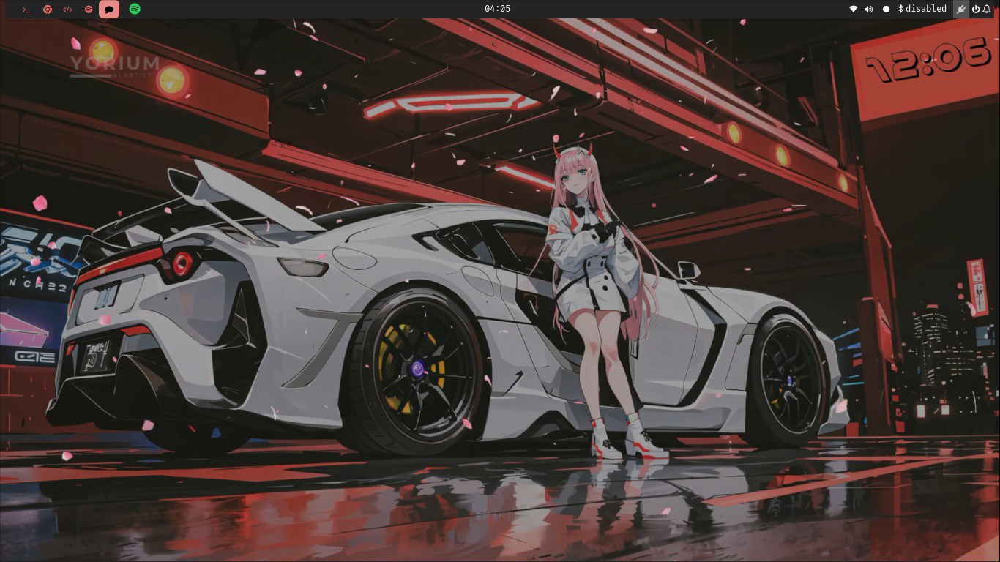
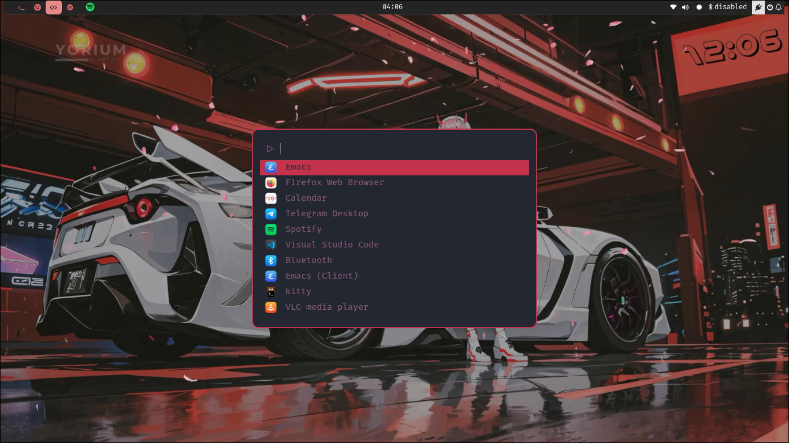
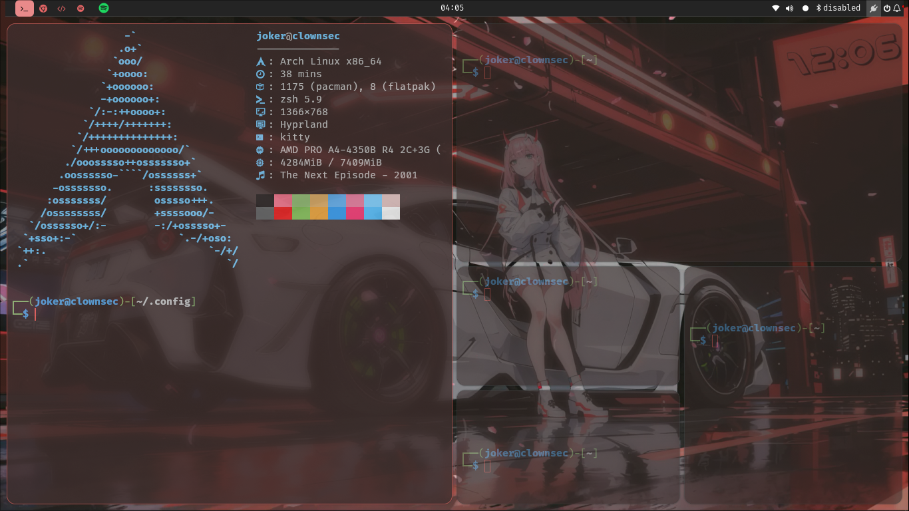
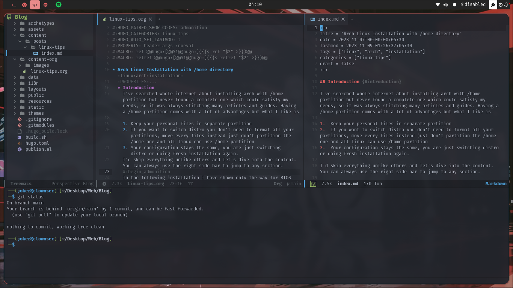
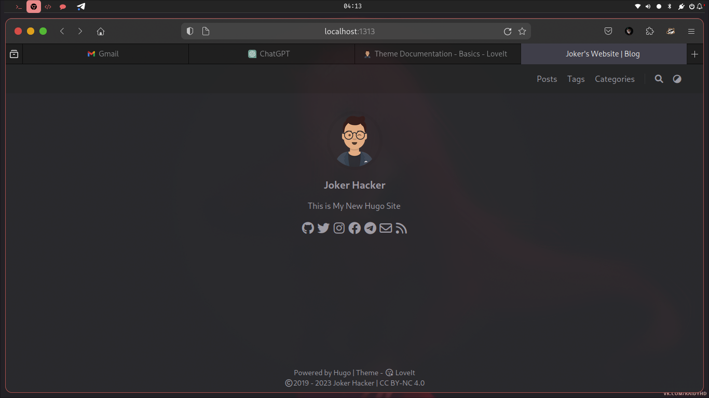
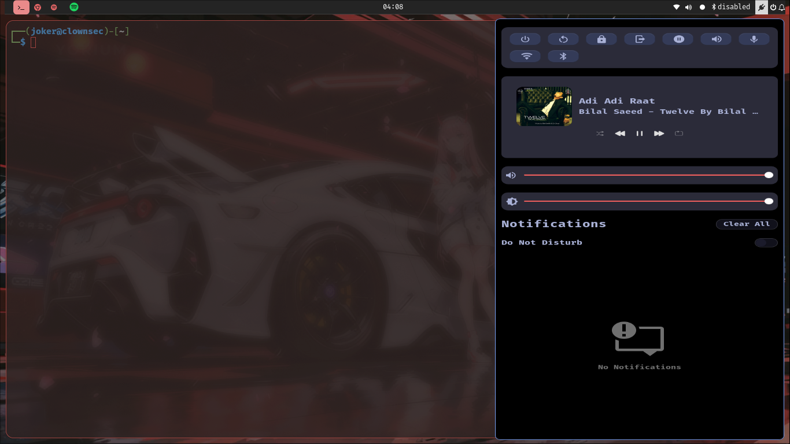

  <h1>Hyprland-Arch Dotfiles v2</h1>
  

    Use at your own risk, these modifications where done according to my taste.
  
  

# Screenshots

### Information
Here are some details of what I used.

| Tool | Used |
| ---- | ---- |
| OS | [Arch Linux](https://archlinux.org/) |
| WM | [Hyprland](hyprland.org/) |
| Terminal | [Kitty](https://github.com/kovidgoyal/kitty) |1
| Shell | [Zsh](https://www.zsh.org/) |
| Editor | [Doom Emacs](https://github.com/doomemacs/doomemacs)/[Vs Code](https://code.visualstudio.com/) |
| Application Launcher | [Fuzzzel](https://codeberg.org/dnkl/fuzzel) |
| Bar | [Waybar](https://github.com/Alexays/Waybar) |
| Wallpaper (live) | [Mpvpaper](https://github.com/GhostNaN/mpvpaper) |

### What's new in this version?
I have updated a lot of things like hyprland new configuration, new live wallpaper, fuzzel launcher (which is actually good and nice), removing some things in the waybar as well and absolutely switching to emacs from neovim. just clone it and tweak more if you like this.

### Why I chose hyprland?
I've been using gnome in kali linux for years, but with my potato
laptop I couldn't achieve great productivity and speed. I tried arch linux quite few times but faced problems each time, with confidence I tried this time and I came successful after trying bspwm and i3.

- Hyprland is really great and easy to customize compared to other tiling window managers like bspwm,I found it little hard for a newbie like me to setup dual monitor but in hyprland it just gets detected automatically and assigns workspace according to that.

- The great thing which comes useful is auto reload of configuration without any hustle and inbuilt compositor
